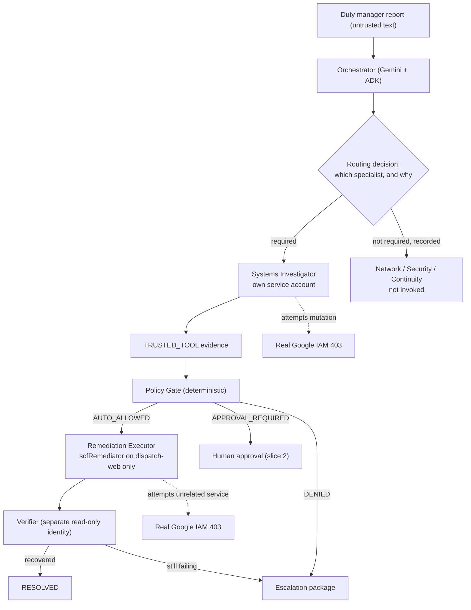

# Architecture

## System goal

Turn one messy report from a non-technical duty manager into a governed,
auditable multi-agent workflow that investigates selectively, acts where safe,
pauses where risky, verifies recovery, and can prove every step afterwards.

## Primary user

A person responsible for a physical site after hours: site supervisor, branch
manager, warehouse supervisor, facilities lead. They should not have to decide
whether the problem belongs to networking, systems, identity, security, or a
vendor.

## Golden rule

> **LLM proposes. Deterministic code decides. Scoped identity executes.**

### Gemini may

- Interpret messy incident reports.
- Decide which specialists are required, and state why.
- Summarize evidence.
- Propose a remediation from a closed enum.

### Deterministic code must

- Classify risk and authorize actions.
- Check required evidence.
- Enforce allow / deny / approval policy.
- Apply idempotency.
- Write tamper-evident audit records.

Identity does the rest: the only component that can mutate infrastructure is a
service account whose IAM role is scoped to one Cloud Run service.

## Workflow



Delegation is **evidence-dependent**. The orchestrator does not fan out to every
investigator; it emits a `RoutingDecision` in which each specialist is either
required with a reason, or explicitly declined with a reason. Declining is a
recorded decision, not an omission.

## Deployment topology

| Component | Type | Runs as |
|---|---|---|
| Orchestrator | Cloud Run, LLM-backed | `sa-orchestrator` |
| Systems Investigator | Cloud Run, LLM-backed, stateless | `sa-agent-systems` |
| Policy Gate | in-process pure function | caller's identity |
| Remediation Executor | Cloud Run, no LLM | `sa-executor` |
| Verifier | Cloud Run, no LLM | `sa-verifier` |
| `dispatch-web` | Cloud Run, the real target | — |
| `site-directory` | Cloud Run, unrelated service for IAM proof C | — |

Investigators are stateless and never write Firestore. The orchestrator
persists on their behalf. This is what turns `datastore.viewer` into a real
boundary instead of a naming convention.

## Regions and data handling

| Concern | Location | Why |
|---|---|---|
| Cloud Run, Firestore, Artifact Registry | Sydney `australia-southeast1` | Authoritative state and privileged execution stay in Australia |
| Model Armor inspection *(PLANNED)* | Melbourne `australia-southeast2` | No Sydney region; nearest Australian region |
| Gemini 3.7 Flash inference | `global` | No Australian inference endpoint published |

Model Armor is not offered in Sydney, so security inspection makes a deliberate
Sydney → Melbourne hop. That leg is entirely within Australia.

Model inference is not. Gemini 3.7 Flash publishes inference endpoints for
`global`, `us`, and `eu` only; a real call to the Sydney regional endpoint
returned `404 NOT_FOUND` for the publisher model
(`docs/evidence/gate-a-vertex-gemini.md`). Gemini 3.5 Flash has no Sydney
endpoint either, so downgrading the model family does not avoid the constraint.

Using the `global` endpoint is therefore an **intentional, approved
architecture decision, not a fallback**. `config.MODEL_LOCATION = "global"`.

### What this means for residency

Authoritative incident state, audit records, and privileged execution remain on
Australian Google Cloud infrastructure. Model inference does not.

**Complete Australian data residency is not claimed anywhere in this project.**
The competition environment uses synthetic data only.

Because inference leaves the country, the classification and security boundary
is load-bearing rather than decorative: untrusted incident content is inspected
by Model Armor in Melbourne *before* it reaches an agent or a tool, and
sensitive or policy-restricted content must never be silently forwarded to the
global endpoint.

**Status: PLANNED.** Model Armor is NOT integrated. Until it is, the boundary
that actually holds is the trust-level separation: untrusted report text is
recorded as `UNTRUSTED_INPUT` and can never satisfy a policy condition. No
prompt-injection resistance is claimed.

## State — two planes

| Plane | Database | Holds | Executor access |
|---|---|---|---|
| **Authoritative control** | `(default)` | incidents, evidence, decisions, audit | read only |
| **Execution** | `execution-state` | idempotency claims, executor receipts | create/update, no delete |

Both Sydney `australia-southeast1`, separated by per-database IAM conditions.
The rule the split enforces: **the identity able to mutate Cloud Run must be
unable to modify the authorization decision permitting that mutation.**

The executor never writes the control plane. It returns a receipt, and the
orchestrator — an authoritative writer — records the action and audit entry.
That also keeps a single writer on the hash-chained audit log, so sequence
numbers cannot race.

This is database-level isolation. Firestore IAM cannot scope below a database;
see `SECURITY.md`.

Firestore is the authoritative incident and audit store.

- `(default)`: `incidents/{id}` aggregate root with an explicit 17-state
  machine, plus `/evidence`, `/decisions`, `/actions`, `/audit` subcollections.
  The incident document also carries `audit_seq` and `audit_tail_hash`.
- `execution-state`: `executions/{execution_id}` lifecycle documents and
  `receipts/{action_id}`.

Transitions are compare-and-set inside a transaction against a declared legal
transition table (`src/scf/domain/state_machine.py`). An illegal transition
raises and is audited. `EXECUTING` is reachable only from `AUTO_ALLOWED` or
`APPROVED`.

## Idempotency

```
sha256(incident_id | action_type | target_ref | decision_id)
```

One authoritative decision has exactly one execution identity. **Nothing a
caller supplies participates in the derivation**, so no request field can mint
a second infrastructure execution for the same authorization. An earlier design
mixed in a caller-supplied `attempt_intent`, which meant any client able to
reach the executor could re-run a completed mutation.

Ownership is taken with a Firestore transaction that either creates the
execution document or takes over an expired lease. Exactly one worker holds a
live lease; a duplicate arriving while it is held is refused.

### Fencing

Ownership carries a `lease_epoch`: generated by the execution plane, never
supplied by a caller, immutable for one ownership period, incremented on every
expired-lease takeover. Every worker transition is one Firestore transaction
asserting all five of — not terminal, owner matches, epoch matches, lease
unexpired, current state as expected. A worker whose lease was taken writes
nothing and is told so deterministically (`FENCED_OUT`, `LEASE_LOST`,
`ALREADY_TERMINAL`, `STATE_MISMATCH`).

The state `PRECONDITION_CHECKED` is written immediately before the Cloud Run
snapshot is read. Because that write is ownership-bound, a fenced worker never
obtains a `resourceVersion` at all.

### The mutation primitive

The traffic change is Knative **v1** `namespaces.services.replaceService`
carrying `metadata.resourceVersion` from the authorized read. Cloud Run **v2**
`services.patch` was tested live and does **not** enforce `etag` for this call —
a stale etag, a stale `If-Match:` header and a bogus etag string were all
accepted with HTTP 200 — so no concurrency claim rests on it. v1 rejects a stale
`resourceVersion` with HTTP 409 ABORTED and leaves the service untouched. This
is a positive selection of the operation that provides the required property,
made under the permissions already held. Evidence:
`docs/evidence/gate-d3a-cloud-run-resourceversion-cas.md`.

The replacement body is built defensively: `spec.template.metadata.name` is
pinned so a traffic-only rollback cannot mint a revision, and traffic tags are
carried across so the operator's `known-good` marker survives.

### Terminalization

After a successful mutation the execution is `MUTATED`, which is deliberately
**not** terminal. The independent verifier must observe the exact authorized
revision at exactly 100% of traffic with nothing else serving, plus a healthy
response; the executor must then independently re-observe the same thing before
the execution becomes `VERIFIED`. Only then may the incident be `RESOLVED`. An
incident is never resolved while its execution is still recoverable.

If verification cannot be obtained at all, the incident stops at
`REMEDIATION_FAILED` — also non-terminal — and `POST /incidents/{id}/reconcile`
resumes it from live infrastructure rather than guessing.

### What is and is not claimed

Firestore and the Cloud Run Admin API cannot be committed together, so this is
**not** globally exactly-once distributed execution. The honest property is
**fenced, duplicate-safe, recoverable, effect-idempotent execution with
reconciliation**: before mutating, the executor re-reads real infrastructure
and either finds the authorized target already active (reconcile, do not
mutate), finds the authorized source state (proceed), or finds neither and
fails closed as `STALE_EVIDENCE`.

**The stale-worker window is narrowed by both layers and closed by neither
alone.** A worker that loses its lease after its final ownership check can
still reach the Cloud Run API if the Service has not changed in the interim.
It can only ever request the exact `authorized_target_revision` from the
persisted decision, so the effect is identical to the one already authorized,
and it cannot advance the execution lifecycle state or write a receipt: the
fenced write is refused and logged at ERROR as `execution_state_write_fenced`.
What it can still do is return a truthful response saying the mutation was
issued, which the orchestrator records as an action — that record is accurate,
and terminalization is gated on re-observed infrastructure rather than on it.
This is stated rather than denied.

Execution documents are never deleted, and the executor holds no delete
permission, so a claim cannot be retracted to manufacture a retry. One
*authorization fingerprint* — incident, action, target, exact revision, policy
version, evidence snapshot — binds to exactly one execution identity, so an
equivalent re-issued decision cannot become a second effect.

Pub/Sub is deliberately excluded from the MVP. Replay proof is performed by
delivering the same execution request repeatedly and showing exactly one
mutation, measured by the Cloud Run service generation counter.

## Audit

Append-only, hash-chained records committing to sequence, actor, actor
identity, event, payload, and trace/span ids. `verify_chain()` detects edits,
reordering, mid-chain deletion, and forged appends.

Truncation of the tail leaves a valid prefix, so `verify_incident_chain()`
additionally checks the trail against the incident document's own `audit_seq`
and `audit_tail_hash`, written in the same transaction as each record. A
missing tail, an unaccounted append, or a tail-hash mismatch is therefore
detected as well.

The audit is **tamper-evident, not immutable.** A compromised authoritative
writer holds both the records and the tail metadata and could rewrite the
complete chain consistently; detecting that needs an external witness this
system does not have. Stated as a limitation in `SECURITY.md` rather than
hidden.

## Observability

One OpenTelemetry trace per incident, spanning intake → orchestrator →
investigator → policy → executor → verifier.

**Status: structured Cloud Logging correlation only.** Every service emits JSON
entries carrying the same `trace_id`, and the `trace_id` is stored on the
incident document so the audit trail and the logs can be correlated from either
direction. **No span has been exported to Cloud Trace.** OpenTelemetry export is
PLANNED, not integrated.

## Out of scope until slice 1 is verified

Polished frontend, voice, video, vendor integrations, additional Google models,
Memory Bank, Agent Gateway, Pub/Sub, multiple sites, complex remediations.
