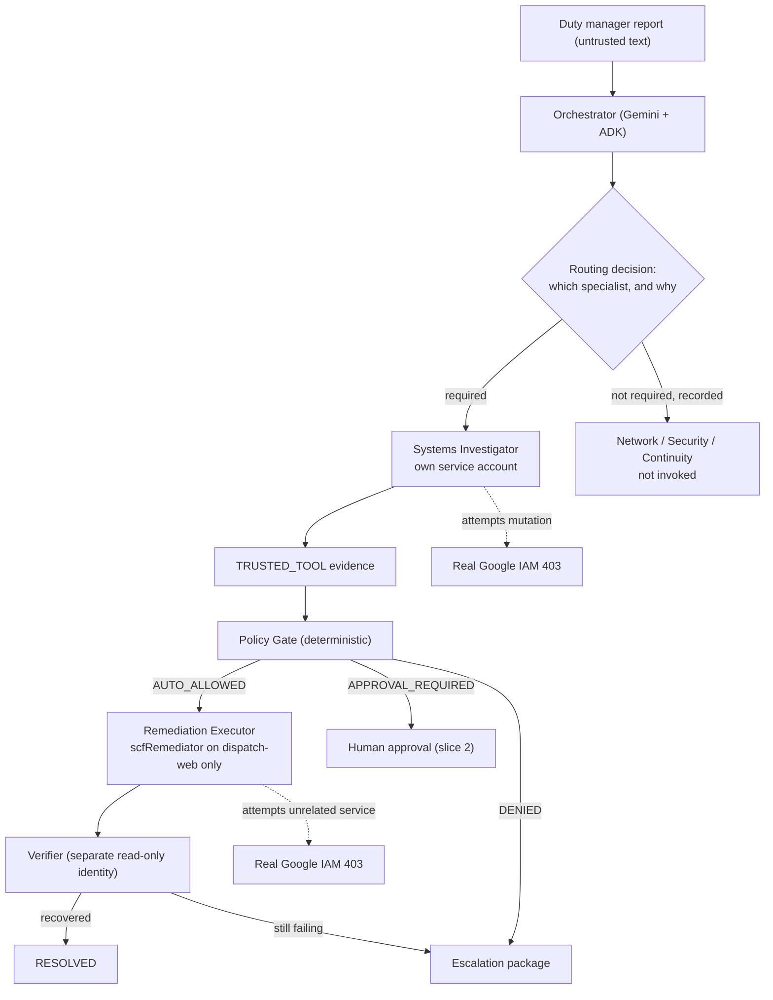

# Architecture

## System goal

Turn one messy report from a non-technical duty manager into a governed,
auditable multi-agent workflow that investigates selectively, acts where safe,
pauses where risky, verifies recovery, and can prove every step afterwards.

## Primary user

A person responsible for a physical site after hours: site supervisor, branch
manager, warehouse supervisor, facilities lead. They should not have to decide
whether the problem belongs to networking, systems, identity, security, or a
vendor.

## Golden rule

> **LLM proposes. Deterministic code decides. Scoped identity executes.**

### Gemini may

- Interpret messy incident reports.
- Decide which specialists are required, and state why.
- Summarize evidence.
- Propose a remediation from a closed enum.

### Deterministic code must

- Classify risk and authorize actions.
- Check required evidence.
- Enforce allow / deny / approval policy.
- Apply idempotency.
- Write immutable audit records.

Identity does the rest: the only component that can mutate infrastructure is a
service account whose IAM role is scoped to one Cloud Run service.

## Workflow



Delegation is **evidence-dependent**. The orchestrator does not fan out to every
investigator; it emits a `RoutingDecision` in which each specialist is either
required with a reason, or explicitly declined with a reason. Declining is a
recorded decision, not an omission.

## Deployment topology

| Component | Type | Runs as |
|---|---|---|
| Orchestrator | Cloud Run, LLM-backed | `sa-orchestrator` |
| Systems Investigator | Cloud Run, LLM-backed, stateless | `sa-agent-systems` |
| Policy Gate | in-process pure function | caller's identity |
| Remediation Executor | Cloud Run, no LLM | `sa-executor` |
| Verifier | Cloud Run, no LLM | `sa-verifier` |
| `dispatch-web` | Cloud Run, the real target | — |
| `site-directory` | Cloud Run, unrelated service for IAM proof C | — |

Investigators are stateless and never write Firestore. The orchestrator
persists on their behalf. This is what turns `datastore.viewer` into a real
boundary instead of a naming convention.

## Regions

Core stack is single-region **Sydney (`australia-southeast1`)**: Cloud Run,
Firestore, Vertex AI, Artifact Registry, Logging, Trace, Secret Manager.

Model Armor is not offered in Sydney. Google's Australian Model Armor region is
**Melbourne (`australia-southeast2`)**, so security inspection makes a
deliberate Sydney → Melbourne hop. The design is all-Australian; it is not
single-region, and this document says so rather than implying otherwise.

The global Gemini endpoint is **not** a silent fallback
(`config.ALLOW_GLOBAL_ENDPOINT_FALLBACK = False`). If Sydney cannot serve the
model, the build stops and the decision is escalated.

## State

Firestore is the authoritative incident and audit store.

- `incidents/{id}` — aggregate root with an explicit 17-state machine.
- `/evidence`, `/proposals`, `/decisions`, `/actions`, `/audit` subcollections.
- `idempotency/{key}` — global claim documents.

Transitions are compare-and-set inside a transaction against a declared legal
transition table (`src/scf/domain/state_machine.py`). An illegal transition
raises and is audited. `EXECUTING` is reachable only from `AUTO_ALLOWED` or
`APPROVED`.

## Idempotency

```
sha256(incident_id | action_type | target_ref | decision_id | attempt_intent)
```

Derived from the authorizing decision, so re-delivery of the same approved
decision collapses to exactly one execution. A deliberate retry supplies a new
`attempt_intent`. The claim is made with a Firestore `create()` inside a
transaction — failure to create *is* the duplicate signal.

Pub/Sub is deliberately excluded from the MVP. Replay proof is performed by
delivering the same execution request three times and showing exactly one
mutation.

## Audit

Append-only, hash-chained records committing to sequence, actor, actor
identity, event, payload, and trace/span ids. `verify_chain()` detects edits,
reordering, mid-chain deletion, and forged appends. Truncation of the tail
leaves a valid prefix and is caught by an expected-length check; this is stated
as a limitation in `SECURITY.md` rather than hidden.

## Observability

One OpenTelemetry trace per incident, spanning intake → orchestrator →
investigator → policy → executor → verifier, exported to Cloud Trace. The
`trace_id` is stored on the incident document so the audit trail and the trace
can be correlated from either direction.

## Out of scope until slice 1 is verified

Polished frontend, voice, video, vendor integrations, additional Google models,
Memory Bank, Agent Gateway, Pub/Sub, multiple sites, complex remediations.
