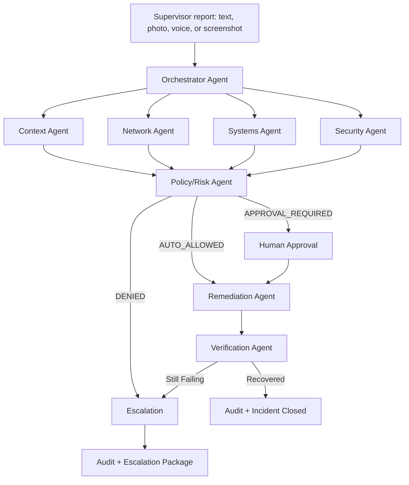

# Architecture

## System Goal

Turn one frontline incident report into a governed, auditable multi-agent workflow that investigates, acts where safe, pauses where risky, and verifies recovery.

## Primary User

A non-technical person responsible for a physical site after hours: site supervisor, branch manager, warehouse supervisor, facilities lead, school manager, or construction supervisor.

The user should not need to decide whether the problem belongs to networking, systems, identity, security, facilities, a vendor, or an application team.

## Workflow

## Local Day 1 Architecture

- Python package under `src/scf`.
- Deterministic synthetic simulator for sites, services, network state, and security flags.
- Agent classes that produce typed evidence.
- Deterministic policy gate for mutating action decisions.
- Local CLI for repeatable demos.
- Unit tests for the four core demo moments.

## Planned Competition Architecture

- Model: Gemini 3.5 Flash first.
- Agent framework: Google ADK 2.0 Python.
- Runtime: Agent Runtime where practical, Cloud Run fallback where time or access blocks.
- State: Firestore as authoritative incident and audit store.
- Async events: Pub/Sub.
- Identity: Agent Identity or first-party IAM/service-account equivalent if Agent Identity setup blocks.
- Gateway and protection: Agent Gateway plus Model Armor where viable; otherwise direct Model Armor checks in the application path with clear documentation.
- Telemetry: OpenTelemetry traces, Cloud Logging, and Cloud Trace.
- Frontend: compact web dashboard for supervisor intake, workflow state, approvals, and audit evidence.

## Security Model

The LLM never receives final authority over dangerous changes.

Gemini may:

- Interpret messy incident reports.
- Summarize evidence.
- Propose a likely root cause.
- Propose a remediation plan.

Deterministic code must:

- Classify risk.
- Check required evidence.
- Enforce allow/deny/approval policy.
- Authorize tool calls by agent identity.
- Apply idempotency.
- Write immutable audit records.

## Action Contract

Every mutating tool call must include:

- `incident_id`
- `action_id`
- `idempotency_key`
- `actor_identity`
- `evidence`
- `policy_decision`

This is not ceremony. It handles retries, duplicate Pub/Sub deliveries, traceability, least privilege, and judge-facing proof.

## Demo Moments

1. Unlikely hero: a site supervisor submits a vague site-down report.
2. Autonomous fleet: specialist agents gather evidence and a safe action changes system state.
3. Enterprise governance: a risky production database restart pauses for approval.
4. Attack the agents: malicious instructions in incident content are blocked, and unauthorized tool use returns `PERMISSION_DENIED`.

